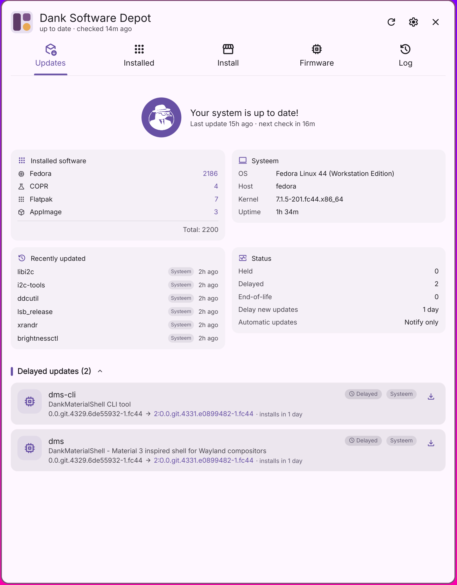

# <picture><source media="(prefers-color-scheme: dark)" srcset="assets/icons/dank-software-depot-dark.svg"></picture> Dank Software Depot

**Beta** · **Fedora-based distros (Debian/Ubuntu & Arch experimental)** · English / Nederlands / Deutsch / Français / Español / Português / Italiano / Polski / Svenska / 中文

A full software & updates center plugin for
[DankMaterialShell](https://github.com/AvengeMedia/DankMaterialShell):
everything the built-in updater does, plus app logos, release notes, reviews,
honest per-package progress, an app store, AppImage management, firmware
support and an action log — and no terminal output anywhere.



Built on top of the DMS system update service (the `dms` daemon does update
detection and dnf transactions; polkit prompts appear through the DMS agent).

## Status

- **Beta.** Actively developed; things may move around. Feedback and issues
  are welcome.
- **Fedora-based distros first** (Fedora, Nobara, RHEL/CentOS family):
  package management uses libdnf5 and Fedora AppStream metadata.
  **Debian/Ubuntu and Arch support is experimental**: transactions
  (python-apt / pyalpm), search, sizes, inventory, holds, changelogs and
  the AppStream catalog are implemented, but not yet validated on real
  desktop installs — see PROTOCOL.md for what is left. AUR is out of
  scope (official Arch repos only). The app shows an experimental banner
  on these distros and warns on unsupported ones. Flatpak, AppImage and
  firmware support are distro-agnostic.

## The five tabs

### 1 · Updates
- Rich update cards: logo, name, summary, `old → new` versions, repo chip,
  homepage link, expandable sanitized release notes (AppStream releases for
  apps, rpm changelog fallback), per-app update button
- Sections (Applications / System / Runtimes / Firmware / Held)
  with a hover **Update these** button per section
- **Held packages**: dnf versionlock/excludepkgs detected automatically,
  plus user-holds via the lock button — never counted or updated,
  releasable any time
- **Automatic updates**: off / notify only / auto-install Flatpaks
- During a run the list regroups by what is happening — **In progress**,
  **Waiting**, **Completed** (collapsed) — so the packages actually being
  worked on are the first thing on screen. Each row has its own progress
  bar built from real bytes (flatpak transaction events, libdnf5 callbacks)
- A package that fails keeps its reason on its card, including after the
  shell reload a DMS update causes, with the tool's verbatim output one
  click away under **Show details** — the same detail the action log keeps
- Reboot recommendation banner (kernel/systemd/glibc/firmware) with
  confirm-restart button, persisted per boot
- End-of-life Flatpak detection and distro-upgrade notice
- **DMS updates run last**: updating DMS/Quickshell packages live-reloads
  the shell, so they run in a final daemon pass after everything else
  (the transaction completes even if the shell reloads mid-way)
- Up-to-date dashboard: installed-software counts per source, system info,
  recently updated packages and the current updater status at a glance

### 2 · Installed
- All Flatpak apps, rpm packages and AppImages in one list: live search,
  source filter, sorting (name / largest / recently updated) with sizes
- **Applications first, supporting packages after**: anything that owns a
  desktop entry your launcher would show counts as an application, in its
  own group with a count — which is also where packages outside AppStream
  get their icon and name from
- Details popup per app: description, screenshots, star ratings and review
  texts (ODRS), release notes / changelog, homepage, sandbox permissions —
  and you can write a review yourself
- Actions: uninstall (with confirm), hold toggle, open, restore a previous
  version (Flatpak via commit history, rpm via `dnf downgrade` where repos
  still carry an older build)
- **AppImage update source**: link a GitHub project to any AppImage in the
  popup and its releases become the update channel
- Live progress on every mutation: phase text and an animated progress bar
  ("Loading repositories…", "Removing 2/3 · 67%", …)

### 3 · Install
- **Popular-software storefront** before you search: most-reviewed apps
  (ODRS) grouped by category, one-click install
- Live search across the system repos and Flathub (cached AppStream
  index), plus a package-name fallback so plain CLI packages
  (e.g. `playerctl`) are found too
- **Source choice** when an app ships from multiple sources
  (system repo / Flathub / AppImage)
- ODRS star ratings with review counts
- Live install progress: package-manager library and libflatpak events are
  turned into a progress panel with app icon, phase text and a transaction-
  wide percentage (repositories → download x/y → install)
- **AppImage support**: searchable catalog (appimage.github.io, 1400+ apps),
  install straight from the app's GitHub releases or from a local file/URL;
  icon and desktop entry are extracted; installs into the same folder
  Gearlever uses, and existing AppImages are adopted automatically

### 4 · Firmware
- fwupd device inventory: which hardware supports firmware updates, current
  versions, on-demand LVFS release notes
- Pending firmware updates appear in the Updates tab and run in the firmware
  phase of Update All

### 5 · Log
- Persistent history of everything the plugin did: update runs, installs,
  uninstalls, restores/downgrades — entries expand to per-package details
  (old → new version, source, result)
- Searchable; entries are kept for 90 days

## Bar widget & popout

- Bar pill with the effective update count (held excluded);
  spinning refresh icon while checking, completed/planned counter during a
  run, restart icon when a reboot is recommended
- Compact popout: enriched update list, Update All, phase label and
  current item during a run
- Optional: hide the pill when up to date, click opens the window directly

## Languages

The UI ships in **English, Dutch, German, French, Spanish, Portuguese,
Italian, Polish, Swedish and Chinese (Simplified)**. DMS has no per-plugin
i18n mechanism, so the plugin brings its own: the `Tr` singleton loads
`translations/<lang>.json` (keyed by the English source string) following the
DMS/system locale, falling back to the DMS catalog and then English. Add a
language by dropping a new `translations/<lang>.json` next to the others.

## Requirements

- A Fedora-based distribution — or Debian/Ubuntu or Arch (experimental)
- DMS ≥ 1.5 with the `sysupdate` daemon capability
- `python3`, `python3-gobject` + libflatpak GIR
- `flatpak`, optionally `fwupd`
- Package-manager bindings for your distro:
  - Fedora: `python3-libdnf5` (**not** part of a default install)
  - Debian/Ubuntu: `python3-apt` (usually preinstalled)
  - Arch: `pyalpm`

Without those bindings no system package can be installed, updated or
removed; the plugin checks for them at startup and offers to install what
is missing.

Optional, for richer app information (names, icons, screenshots and
release notes for system packages): the AppStream catalog for your
distro — `appstream-data` on Fedora, `appstream` on Debian/Ubuntu,
`archlinux-appstream-data` on Arch. Without it the plugin falls back to
the package manager's own summaries and the icons in your desktop
entries, so apps still look like apps.

## Install

```bash
git clone https://github.com/vinceecniv/DankSoftwareDepot ~/.config/DankMaterialShell/plugins/dankSoftwareDepot
dms restart
```

Enable **Dank Software Depot** in DMS Settings → Plugins, then add the widget
to a DankBar layout.

To launch the window from the app launcher like a standalone app:

```bash
cp com.danklinux.dankSoftwareDepot.desktop ~/.local/share/applications/
```

### IPC

```bash
dms ipc call dankSoftwareDepot open      # open the window
dms ipc call dankSoftwareDepot toggle
dms ipc call dankSoftwareDepot tab 2     # open a specific tab (0-4)
dms ipc call dankSoftwareDepot check     # trigger an update check
```

## Architecture

| Piece | Role |
|---|---|
| `UpdaterWidget.qml` | Bar pill, popout, IPC, reboot logic, settings |
| `UpdaterWindow.qml` | Tabbed window (Updates / Installed / Install / Firmware / Log) |
| `UpdateCard.qml` | Rich per-update card |
| `InstalledView.qml` | Installed software browser + actions |
| `InstallView.qml` | Storefront + cross-source software search & install |
| `FirmwareView.qml` | fwupd device inventory |
| `LogView.qml` | Action history browser |
| `AppDetailsDialog.qml` | Shared app-details popup (info, reviews, actions) |
| `UpdateEngine.qml` | Run orchestration (daemon dnf → libflatpak → fwupd → DMS packages), per-package progress from log lines and dnf-cache bytes |
| `MetadataStore.qml` | Async enrichment cache + held-state persistence |
| `ActionLog.qml` | Persistent action history (90-day retention) |
| `FirmwareService.qml` | fwupd update detection |
| `PhaseIndicator.qml` | Material phase stepper |
| `Tr.qml` | Plugin-local translation singleton |
| `scripts/enrich.py` | AppStream parsing, dnf fallbacks, holds detection, search index, featured storefront, ODRS ratings, caching, sanitizing |
| `scripts/rpm_helper.py` | libdnf5 transactions (install/remove/upgrade/downgrade) with exact byte progress (NDJSON events, see PROTOCOL.md) |
| `scripts/apt_helper.py` | python-apt counterpart of rpm_helper.py — experimental Debian/Ubuntu transaction backend |
| `scripts/pacman_helper.py` | pyalpm counterpart of rpm_helper.py — experimental Arch transaction backend (official repos, no AUR) |
| `scripts/pkg_backend.py` | Per-distro metadata backend (search, sizes, inventory, holds, versions, changelogs); apt + pacman implemented, dnf stays in enrich.py. Also answers, for every distro, which packages own a launchable desktop entry |
| `scripts/test_dep11.py` | Checks the DEP-11 and apt/pacman changelog paths against real-shaped data, runnable on any distro |
| `scripts/flatpak_helper.py` | libflatpak transactions (updates & installs) with exact byte progress (NDJSON events) |
| `scripts/appimage.py` | AppImage catalog, install/update/uninstall, GitHub update sources, adhoc folder scanning (NDJSON events) |
| `scripts/action_log.py` | Action-log append/prune helper |

Update detection, check interval and ignored packages remain managed by DMS
itself (Settings → System Updater); this plugin consumes that state.

All release-note/HTML content from external sources is reduced to an escaped
minimal markup subset before rendering.

## Development

This plugin is developed with [Claude Code](https://claude.com/claude-code).

## License

MIT
