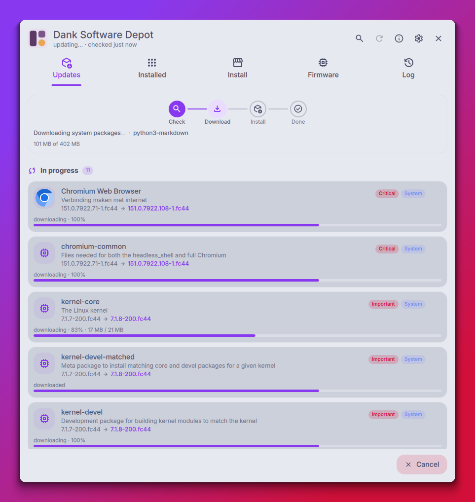
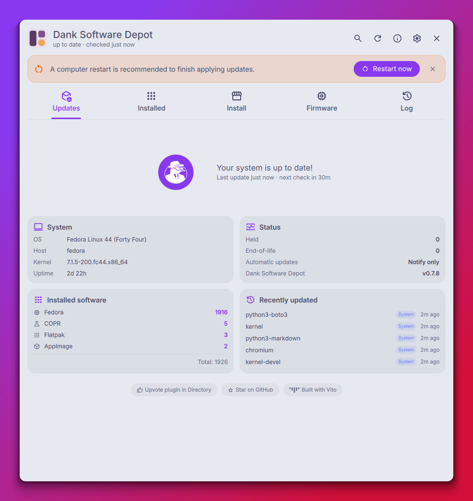
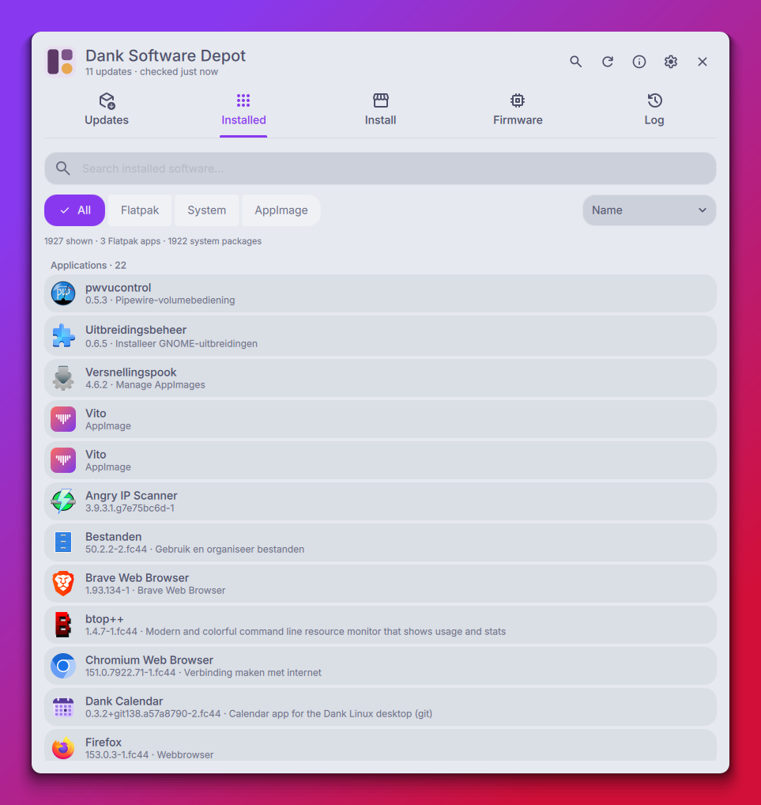
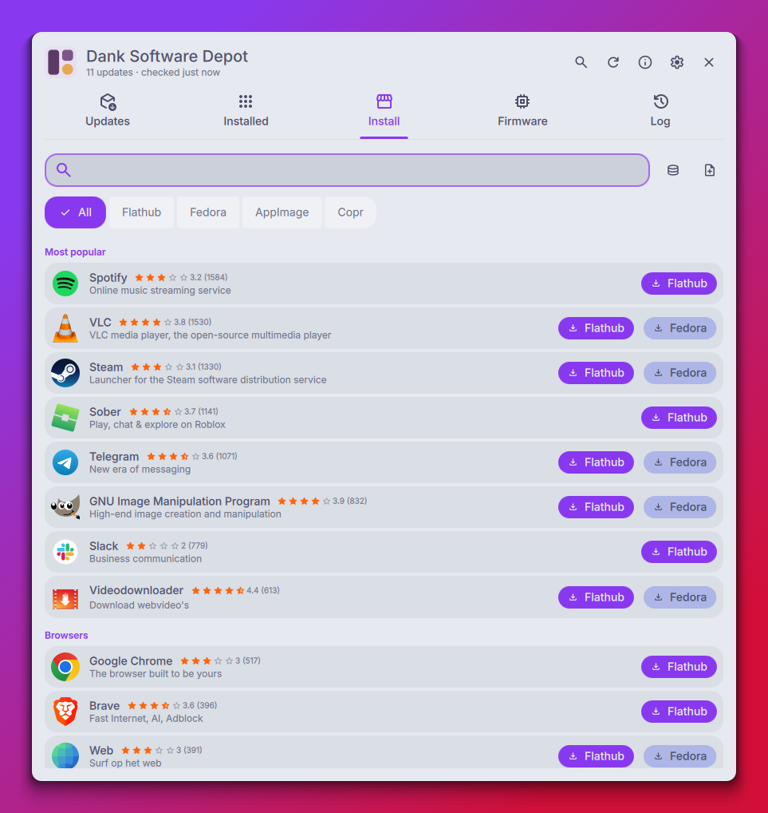
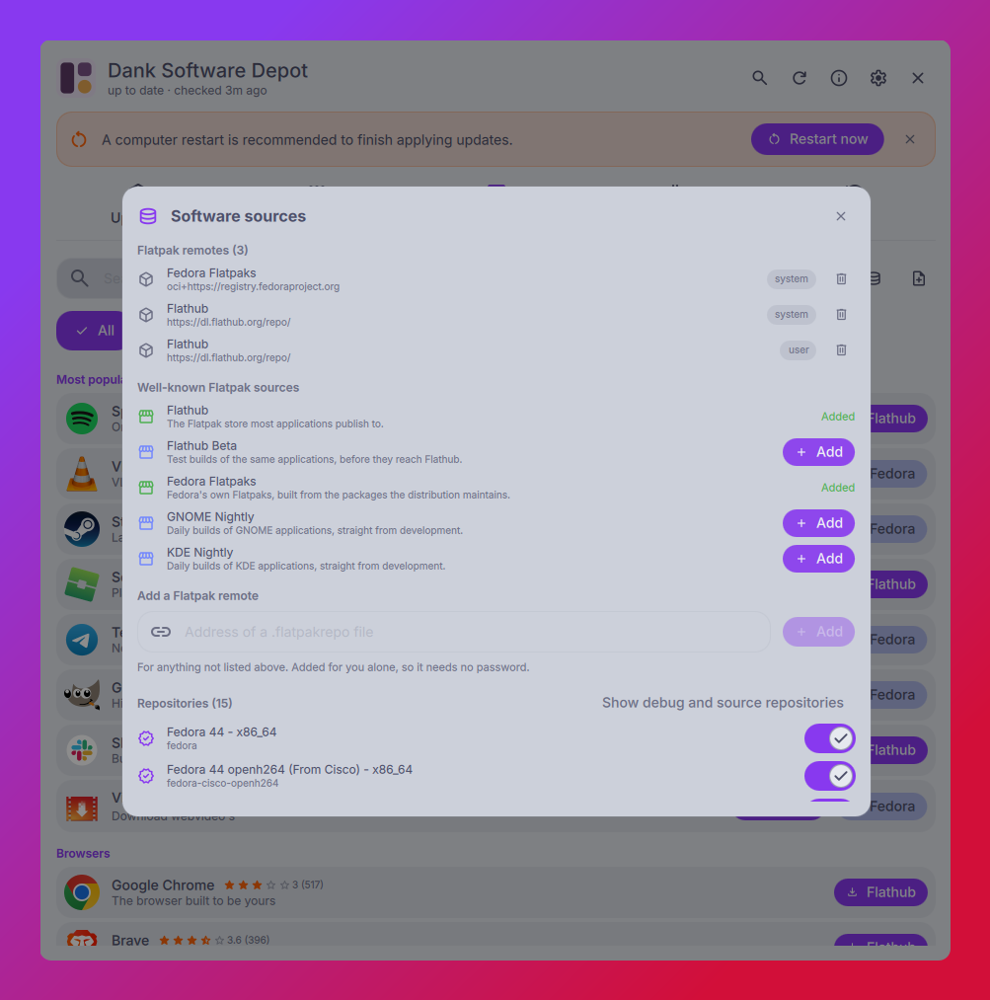
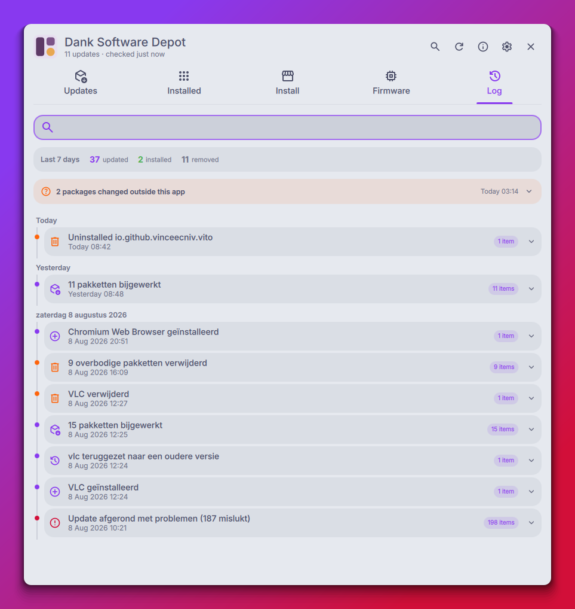
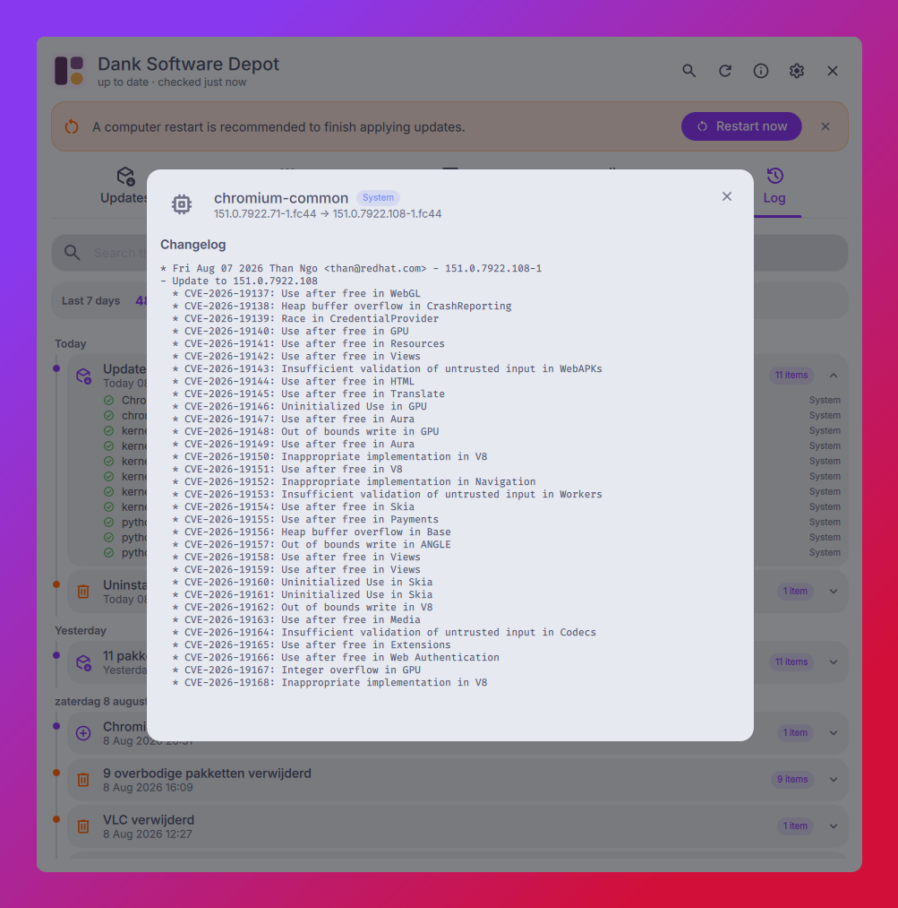
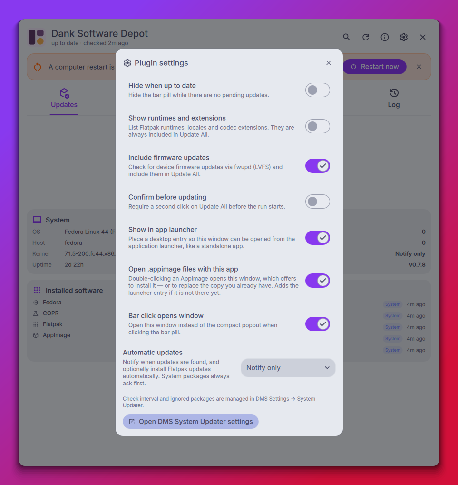
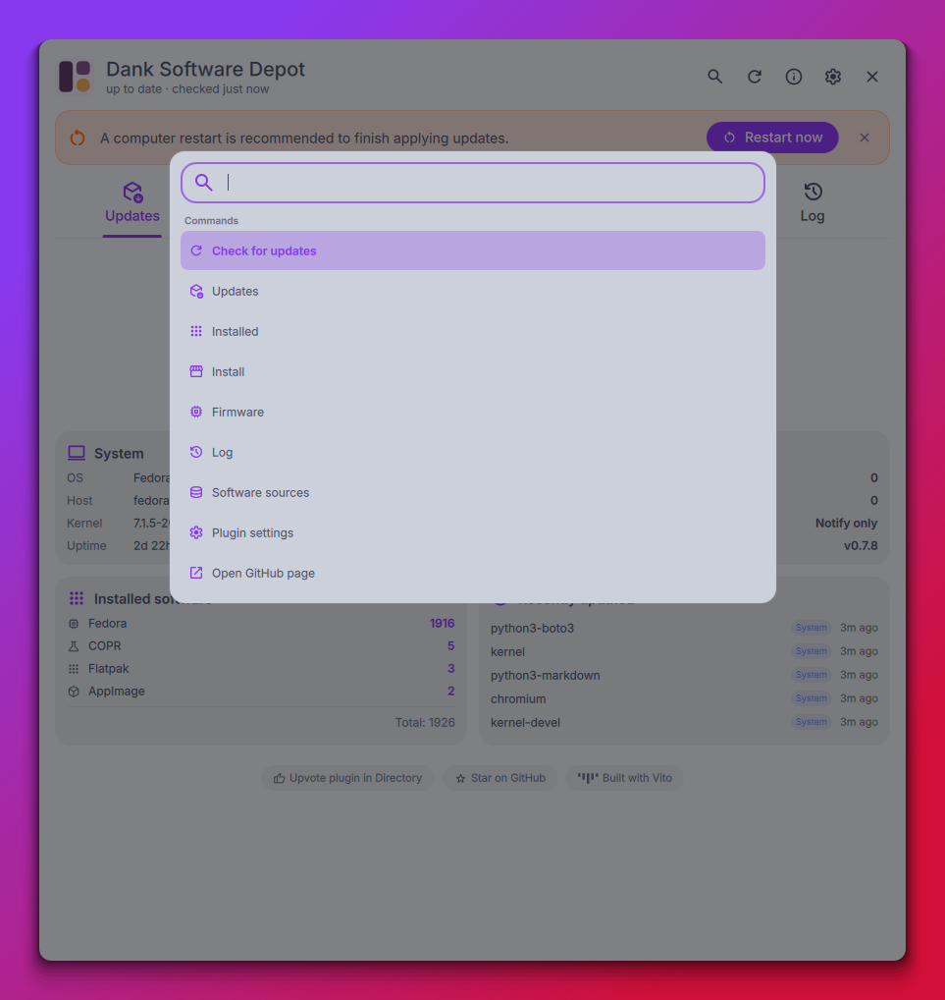

# <picture><source media="(prefers-color-scheme: dark)" srcset="assets/icons/dank-software-depot-dark.svg"></picture> Dank Software Depot

[](https://github.com/vinceecniv/DankSoftwareDepot/releases)
[](https://github.com/vinceecniv/DankSoftwareDepot/actions/workflows/checks.yml)
[](LICENSE)


**Manages** 


**Fedora-based distros** — atomic Fedora, Debian/Ubuntu and Arch experimental ·
English / Nederlands / Deutsch / Français / Español / Português / Italiano /
Polski / Svenska / Українська / Русский / Magyar / 日本語 / 한국어 /
Tiếng Việt / 中文

A full software & updates center plugin for
[DankMaterialShell](https://github.com/AvengeMedia/DankMaterialShell):
everything the built-in updater does, plus app logos, release notes, reviews,
honest per-package progress, an app store, [full AppImage
management](#appimages-end-to-end), firmware support and an action log — and no
terminal output anywhere.

Six kinds of software, managed the same way: system packages, Flatpaks,
AppImages, firmware, the DMS plugins running in the shell around it, and
Homebrew formulae where brew is installed. Beyond what the system already
knows about, it can [search Copr](#3--install) for packages no configured
repository carries, and it can be [the app that opens a downloaded
`.appimage`](#appimages-end-to-end).


Built on top of the DMS system update service (the `dms` daemon does update
detection and dnf transactions; polkit prompts appear through the DMS agent).

## Status

- **Beta.** Actively developed; things may move around. Feedback and issues
  are welcome.
- **Fedora-based distros first** (Fedora, Nobara, RHEL/CentOS family):
  package management uses libdnf5 and Fedora AppStream metadata.
  **Debian/Ubuntu and Arch support is experimental**: transactions
  (python-apt / pyalpm), search, sizes, inventory, holds, changelogs and
  the AppStream catalog are implemented, but not yet validated on real
  desktop installs — see PROTOCOL.md for what is left. AUR is out of
  scope (official Arch repos only). The app shows an experimental banner
  on these distros and warns on unsupported ones. Flatpak, AppImage and
  firmware support are distro-agnostic.
- **An atomic Fedora (Silverblue, Kinoite, Bazzite, Bluefin) is
  experimental too.** Detected by `/run/ostree-booted` and driven through
  `rpm-ostree` instead of libdnf5: installing layers a package, removing
  unlayers one, and an update is the whole deployment rather than a
  choice of packages. Everything lands in the *next* boot, so a finished
  transaction says "takes effect after reboot" and raises the reboot
  notice instead of claiming the package is in use. Removing something
  that came with the image is refused with a reason — that needs an
  override, which is a different promise. See PROTOCOL.md for the whole
  table of differences.

## The five tabs

### 1 · Updates
- Rich update cards: logo, name, summary, `old → new` versions, homepage
  link, expandable sanitized release notes (AppStream releases for apps, rpm
  changelog fallback), per-app update button
- **A chip saying where the row came from**, on the rows where that is not
  already written directly above them: under Applications, which holds
  Flatpaks and AppImages together, under Held, which holds anything at all,
  and during a run, where the groups are In progress and Waiting and the chip
  is the only thing left saying what a row is. Under a heading that names a
  source — System packages, Firmware, Homebrew, DMS plugins — it is the
  heading again in smaller type, so it stays off
- **Section headings stay put while you scroll**, in all four lists: which
  group you are inside, which day of the log you have reached, which
  storefront category you are 400 rows into
- **Packages built from git** (a `*-git` Copr, an AUR `-git` build) have no
  release for the distro to describe, so their notes come from the upstream
  forge instead: the published notes of the release being installed, or the
  commits between the two snapshots when both sides are builds of a branch
- Sections (Applications / System / Runtimes / Firmware / Homebrew / DMS
  plugins / Held)
  with a hover **Update these** button per section
- **Held packages**: dnf versionlock/excludepkgs detected automatically,
  plus user-holds via the lock button — never counted or updated,
  releasable any time. A hold sitting on top of a security fix says so on the
  card, because the one is a reasonable thing to do and the other is what
  makes it unreasonable
- **Security advisories** from the distro's updateinfo, read locally with no
  network: which pending update closes a hole, graded critical / important /
  moderate / low rather than flattened into one word, with the CVE numbers in
  the details popup and a count in the summary line — including how many of
  them are being held back
- **Automatic updates**: off / notify only / auto-install Flatpaks
- During a run the list regroups by what is happening — **In progress**,
  **Waiting**, **Completed** (collapsed) — so the packages actually being
  worked on are the first thing on screen. Each row has its own progress
  bar built from real bytes (flatpak transaction events, libdnf5 callbacks)
- **The stepper follows the work, not the running order.** Every kind of
  software reports its own two stages, so a run that has finished installing
  system packages and started fetching Flatpaks steps *back* to Downloading
  instead of standing on Installing while bytes are still arriving. A stepper
  that only ever moves forwards is tidier and wrong — the run is not a line,
  it is six of them
- A package that fails keeps its reason on its card, including after the
  shell reload a DMS update causes, with the tool's verbatim output one
  click away under **Show details** — the same detail the action log keeps
- **Arch Linux news**, on the distribution that publishes it. Arch announces in
  prose, ahead of time, that an update needs a hand — a key imported, a package
  replaced before the rest will resolve — and a software centre that updates
  such a system without mentioning it is hiding the one thing the distribution
  went out of its way to say. A banner appears only when something unread has
  appeared, because the feed always has *something* in it and an announcement
  that has been true since spring is not news; the first fetch on a new install
  marks the backlog read rather than opening with eleven interruptions nobody
  missed. Items are kept rather than mirrored, so the archive (Ctrl+K → Arch
  Linux news) still has the announcement that explains the state this machine
  is in, long after it scrolled off the feed
- **Homebrew formulae**, on a machine that has brew. It sits beside the
  distribution's package manager rather than instead of it, so it is a kind of
  software here — its own section, counted in the bar pill, upgraded in its own
  phase of Update All. It needs no privileges at all: no pkexec, no polkit, no
  daemon. It also reports no machine-readable progress, so a formula goes from
  active to done rather than filling up, and the phase says out loud that a
  formula without a bottle is compiled from source and can take a while. A
  pinned formula is brew's own word for held, and is left alone. `brew update`
  is a git fetch, so the formula index is refreshed at most every six hours
  rather than on every check
- **DMS plugins are the fifth kind of software**, and the only one living in
  the shell that runs this window. The daemon already works out which
  installed plugins the registry has a newer build of — the flag Settings →
  Plugins counts its own "Available Updates" from — so they are listed in
  their own section, counted in the bar pill, and updated in their own phase
  of Update All, one at a time. No byte progress: the daemon reports a plugin
  as done or not, so the rows say that and no more. This plugin excludes
  itself, because replacing the code running the transaction, during the
  transaction, is what the DMS packages get a separate final pass for — it
  offers its own update from its own release notes instead. Installing,
  removing and browsing plugins stays in DMS, one button away in the
  settings panel
- Reboot recommendation banner (kernel/systemd/glibc/firmware) with
  confirm-restart button, persisted per boot
- End-of-life Flatpak detection and distro-upgrade notice
- **DMS updates run last**: updating DMS/Quickshell packages live-reloads
  the shell, so they run in a final daemon pass after everything else
  (the transaction completes even if the shell reloads mid-way)
- Up-to-date dashboard: installed-software counts per source (plugins
  included), system info down to the DMS version answering for the shell,
  recently updated packages and the current updater status at a glance
- **The last year**, read back out of the action log: how much went through
  here, across how many runs and how often that works out at, the longest
  quiet stretch, the biggest single run, the busiest month, and the package
  you update more often than any other. Counted from the log itself, so it
  says how far back that log actually reaches rather than presenting a
  fortnight as a year — and it stays away entirely until there is a stretch
  worth looking back over

|  |  |
|---|---|
| **A run in progress.** The list regroups around what is happening, and every row carries its own byte-accurate progress bar. | **Nothing to do.** Counts per source, system information, what was updated recently — and the reboot banner when one is recommended. |

### 2 · Installed
- All Flatpak apps, rpm packages and AppImages in one list: live search,
  source filter, sorting (name / largest / recently updated) with sizes
- **Homebrew formulae have their own group** and filter where brew is
  installed, listed by the short name brew shows even when the formula comes
  from a tap and is named in full underneath
- **DMS plugins have their own group** in the list, read from the manifests on
  disk rather than from a registry, with the plugin's own icon (a manifest
  names a Material Symbols glyph rather than shipping an image) and a button
  in the heading that opens DMS's own plugin screen, where they are installed
  and removed. Their details popup shows what a plugin has instead of what a
  package has: author, category, whether it is installed for you or for
  everyone, where it sits on disk, and the permissions it declares
- **Applications first, supporting packages after**: anything that owns a
  desktop entry your launcher would show counts as an application, in its
  own group with a count — which is also where packages outside AppStream
  get their icon and name from
- Details popup per app: description, screenshots, star ratings and review
  texts (ODRS), release notes / changelog, homepage, sandbox permissions —
  and you can write a review yourself
- **Where it comes from**: the same side-by-side comparison the Install tab
  offers, with the source you actually have marked as installed — a single
  "Installed" chip cannot say which of two it means
- Actions: uninstall (with confirm), hold toggle, open, restore a previous
  version (Flatpak via commit history, rpm via `dnf downgrade` where repos
  still carry an older build)
- **AppImage update source**: link a GitHub project to any AppImage in the
  popup and its releases become the update channel
- Live progress on every mutation: phase text and an animated progress bar
  ("Loading repositories…", "Removing 2/3 · 67%", …)

|  |  |
|---|---|
| **Everything installed, in one list.** Flatpaks, system packages and AppImages together, applications first. | **The details popup**, shared with the Install tab: screenshots, permissions, install counts and ODRS reviews. |

### 3 · Install
- **A storefront you can walk through** before you search: thirteen
  sections from Flathub's own top-level categories, most-downloaded first.
  Every heading opens, and behind it is the whole section rather than the
  handful that fitted on the shelf — Games is nearly 900 apps here. Chips
  inside a section say where else to go, rows arrive as you scroll, and
  typing narrows that section instead of leaving it. Whatever matches no
  category lands in *Other* rather than being dropped, so browsing reaches
  the end of the catalog. Software already installed is left out — that is
  what the Installed tab is for — but a search still finds it
- Sections are cut from the same index the search uses, which is what makes
  "all of it" and "searchable in full" one property instead of two promises
- **Ordered by downloads**: Flathub publishes installs per app for the last
  month, fetched once a day. Only software Flathub carries has such a
  figure, so an rpm with no Flatpak sorts last with review volume standing
  in; reading them never waits on the network, since the storefront takes
  what is cached and the refresh happens out of sight
- Live search across the system repos and Flathub (cached AppStream
  index), plus a package-name fallback so plain CLI packages
  (e.g. `playerctl`) are found too
- **Chips above the results** narrow them to one kind, with Copr and Homebrew
  joining only on a machine where they mean anything. Picking one narrows the
  offer to search elsewhere along with it: filtering on Homebrew stops
  offering a Copr search, because its answer could not appear under the filter
  you just set
- **One Install button, and a straight answer behind it.** An app carried by
  both the distribution and Flathub used to put a button for each in the row
  and leave you to know the difference — which is one action with a
  difference nobody wrote down. The row asks once now and opens a picker:
  the sources side by side with the version, the download size, whether it
  is sandboxed and how many permissions it has, and who stands behind it
  (the distribution, a verified publisher, one person on Copr). Under that,
  a paragraph on what each kind of packaging gives you and what it costs. A
  single source still installs with one click
- The picker is honest about what it cannot compare: sizes count the package
  itself and not what it drags in, and versions from two packagers are
  compared on their leading digits only — `3.0.23` and `3.0.23-10.fc44` are
  the same release, so on a tie nothing is marked newest
- **Search Copr** for software no configured repository has. Nothing in Copr
  can turn up in a local search — a package there is invisible to dnf until
  its project is enabled — so the Install tab offers the search as one
  deliberate press rather than a request per keystroke, at the end of the
  results, which is where "not here?" is a question you have arrived at
  rather than one put to you in advance. Results are listed
  apart, under the name of the individual who builds them, and only from
  projects that build for this Fedora and architecture: a Copr that stopped at
  the previous release cannot be enabled here and is not offered. Installing
  one adds its repository as part of the same transaction, so it asks for a
  password once rather than twice
- ODRS star ratings with review counts
- Live install progress: package-manager library and libflatpak events are
  turned into a progress panel with app icon, phase text and a transaction-
  wide percentage (repositories → download x/y → install)
- **Software sources** behind the header button (or Ctrl+K → Software
  sources): the configured repositories with enable/disable switches, the
  Flatpak remotes, one-click RPM Fusion and Flathub where they are missing,
  and Copr add/remove. Debug, source and testing repositories are folded away
  — on a normal Fedora they are two thirds of the list. Switching off a
  repository the distribution is made of asks twice; writing a repository
  definition by hand stays a job for a text editor. Only the dnf family can be
  changed from here: apt and pacman sources are shown read-only, because an
  apt source is a file plus a signing key and a pacman repo lives in a single
  hand-edited `pacman.conf`.
- **Installing a DMS plugin** is a button in the toolbar next to the AppImage
  one. It opens DMS's own plugin screen rather than reimplementing a second
  registry client — this window reports on plugins and updates them, it does
  not sell them
- **Search Homebrew** where brew is installed, asked for rather than assumed —
  the same deliberate press Copr gets, and for the same reason: it is a
  catalogue this window does not index. The search goes through brew's own
  copy of it rather than fetching the 30 MB index again. Results carry the
  version, the description and how many installs the last thirty days saw,
  from brew's own analytics. **Homebrew grew up on macOS**, and its core still
  carries formulae that cannot run on Linux; those are listed greyed with the
  reason rather than dropped, because "this exists, but not for you" is an
  answer. Opening one shows what brew knows: version, licence, homepage,
  dependencies and how often it was installed last month
- **AppImages** are searched, installed and offered from here alongside
  everything else — see [AppImages, end to end](#appimages-end-to-end)

|  |  |
|---|---|
| **The storefront** before you type anything: sections by category, most-downloaded first, each heading opening onto the whole section. | **Software sources.** Flatpak remotes, one-click Flathub and RPM Fusion, and the configured repositories with debug and source ones folded away. |

### 4 · Firmware
- fwupd device inventory: which hardware supports firmware updates, current
  versions, on-demand LVFS release notes
- Pending firmware updates appear in the Updates tab and run in the firmware
  phase of Update All


### 5 · Log
- Persistent history of everything the plugin did: update runs, installs,
  uninstalls, restores/downgrades, holding a package and releasing it — entries expand to per-package details
  (old → new version, source, result)
- **A row that never finished says so** — a clock, not a tick. An entry titled
  *2 packages updated* could show three ticks under it: the count was right
  and the icons were wrong, because a row nobody ever wrote an ending for was
  being drawn as a success. A DMS update reloads the shell mid-run, which is
  exactly how a run ends without writing its last lines; when a later check
  finds the package did land after all, the entry heals itself
- **What this log cannot account for**: the package database knows when every
  package last arrived, this log knows what the plugin did, and the difference
  is somebody else — a terminal, an automatic-update timer, another software
  centre. A line says how many packages and on how many occasions, expanding
  to the names and dates. Matched on time rather than on name, so the
  dependencies that come along with an install count as ours; and never
  earlier than the log's own first entry, because before that there is nothing
  to compare against. System packages only
- **The log follows the interface language.** An entry records what happened
  as a key and its numbers, not as a finished sentence, so switching language
  switches the log with it. Entries written before this stay in the language
  they happened in — the words were all that was saved, so there is nothing to
  translate them from
- Searchable; entries are kept for two years — a window that throws away last
  winter cannot answer anything about a year

|  |  |
|---|---|
| **What happened, and when.** Grouped by day, with the packages that changed outside this app called out separately. | **What an entry closes.** Release notes and rpm changelogs, CVE numbers included, read from what is already on the machine. |

## AppImages, end to end

An AppImage is a file, not a package: nothing knows it exists, nothing tells
you when it changes, and deleting it leaves its menu entry behind. The whole
life of one is handled here, so it is managed software like anything else.

- **Find one**: searchable catalog of the appimage.github.io index (1400+
  apps), listed next to repo and Flathub results with a source choice when an
  app ships more than one way
- **Install one** from the app's own GitHub releases, from a URL, or from a
  file you already have. They land in `~/AppImages` — created on first install,
  the same folder Gearlever uses by default, and its own setting is honoured
  when it points elsewhere
- **Double-click a downloaded `.appimage`** and the window opens on that file,
  offering to install it —
  or to **replace the build already installed** when it recognises one, matched
  on the name inside the image rather than the version in the file name. A
  fresh download is never executable, which is exactly the case where
  double-clicking otherwise does nothing at all; the file is read without being
  modified. The association is on by default, claimed once and only when
  `.appimage` is going spare — another app already holding it was somebody's
  choice and is left alone. Settings → *Open .appimage files with this app*
  takes it back or hands it over at any time
- **It shows up like an app**: icon and desktop entry are extracted from the
  image, so it appears in your launcher with the right name and logo
- **Existing AppImages are adopted automatically** — the folder is scanned, and
  images installed before this plugin existed are managed from then on
- **Updates**: link a GitHub project to any AppImage and its releases become
  the update channel. Pending AppImage updates appear in the Updates tab and
  run in their own phase of Update All, with byte progress
- **Uninstall** takes the file, its desktop entry, its icon and its record


## Bar widget & popout

- Bar pill with the effective update count (held excluded);
  spinning refresh icon while checking, completed/planned counter during a
  run, restart icon when a reboot is recommended
- Compact popout: enriched update list, Update All, phase label and
  current item during a run. While a check runs, the Dank logo stays where it
  is and pulses — the same two rings the shell's own System Check page uses —
  instead of being replaced by a spinner
- Optional: hide the pill when up to date, click opens the window directly

## Settings & command palette

Everything the plugin decides for itself lives in one dialog behind the gear;
everything it can do is one **Ctrl+K** away. Check interval and ignored
packages stay with DMS, and the dialog links straight to them. The same
switches appear on the plugin's page in DMS Settings → Plugins, so whichever
one you find first is the whole set.

Optional there: **app icons in the theme colour**. Off by default, because an
app's icon is its own identity and a catalog where every one of them is the
same colour is harder to scan rather than easier — but some palettes make a
wall of unrelated logos look like confetti, and this is for those. Icons are
drawn in the active DMS accent, tuned separately for light and dark mode,
since the effect maps an icon's own brightness onto the accent and that lands
very differently on a light card than on a dark one.

|  |  |
|---|---|
| **Plugin settings.** What the pill shows, whether firmware joins Update All, the launcher entry, themed app icons, and who opens `.appimage` files. | **Ctrl+K.** Every tab, the actions around them, and the two dialogs — without going looking for a button. |

## Languages

The UI ships in **English, Dutch, German, French, Spanish, Portuguese,
Italian, Polish, Swedish, Ukrainian, Russian, Hungarian, Japanese, Korean,
Vietnamese and Chinese (Simplified)** — sixteen languages. DMS has no per-plugin
i18n mechanism, so the plugin brings its own: the `Tr` singleton loads
`translations/<lang>.json` (keyed by the English source string) following the
DMS/system locale, falling back to the DMS catalog and then English. Add a
language by dropping a new `translations/<lang>.json` next to the others.

## Requirements

- A Fedora-based distribution — or an atomic Fedora, Debian/Ubuntu or Arch
  (all three experimental)
- DMS ≥ 1.5 with the `sysupdate` daemon capability
- `python3` and `flatpak`, optionally `fwupd`, and optionally Homebrew — the
  brew section appears only on a machine that has it
- Package-manager bindings for your distro:
  - Fedora: `python3-libdnf5` (**not** part of a default install)
  - Atomic Fedora: nothing extra — `rpm-ostree` is the image's own tool
  - Debian/Ubuntu: `python3-apt` (usually preinstalled)
  - Arch: `pyalpm`
- Flatpak bindings — PyGObject *and* the Flatpak typelib, which are two
  packages:
  - Fedora: `python3-gobject-base` (the typelib comes with `flatpak-libs`)
  - Debian/Ubuntu: `python3-gi` **and** `gir1.2-flatpak-1.0`, which
    `flatpak` does not pull in
  - Arch: `python-gobject`

Without the package-manager bindings no system package can be installed,
updated or removed; without the Flatpak ones no Flatpak can. The plugin
checks both at startup and offers to install what is missing, naming the
packages for your distribution.

Optional, for richer app information (names, icons, screenshots and
release notes for system packages): the AppStream catalog for your
distro — `appstream-data` on Fedora, `appstream` on Debian/Ubuntu,
`archlinux-appstream-data` on Arch. Without it the plugin falls back to
the package manager's own summaries and the icons in your desktop
entries, so apps still look like apps.

## Install

```bash
git clone https://github.com/vinceecniv/DankSoftwareDepot ~/.config/DankMaterialShell/plugins/dankSoftwareDepot
dms restart
```

Enable **Dank Software Depot** in DMS Settings → Plugins, then add the widget
to a DankBar layout.

To launch the window from the app launcher like a standalone app, let the app
place the entry itself: the Updates tab offers it once ("Add"), and
**Settings → Show in app launcher** switches it on or off at any time. Both
write a desktop entry and its icon into your own home directory — no root, and
removing the switch takes them away again.

The same by hand, if you would rather (the entry names the icon, so without the
second step the launcher shows a blank one):

```bash
sed "s|@OPEN@|$PWD/scripts/open.sh|" com.danklinux.dankSoftwareDepot.desktop \
  > ~/.local/share/applications/com.danklinux.dankSoftwareDepot.desktop
chmod +x scripts/open.sh
install -Dm644 assets/icons/dank-software-depot-dark.svg \
  ~/.local/share/icons/hicolor/scalable/apps/dank-software-depot.svg
install -Dm644 assets/icons/dank-software-depot-symbolic.svg \
  ~/.local/share/icons/hicolor/symbolic/apps/dank-software-depot-symbolic.svg
update-desktop-database ~/.local/share/applications
```

The entry runs `scripts/open.sh`, which calls the IPC below — so DMS must be
running; it opens the window in the shell rather than starting a second
process. The shim exists because a launcher gives a program a narrower `PATH`
than a terminal does, and `dms ipc` needs both `dms` and `qs` on it; and
because `dms ipc call` answers success even when it reached nobody. Either way
the entry used to do nothing at all, silently. Now it looks in the usual places
and, if it still cannot get through, says so in a notification.

An entry written by an older version of the plugin carries no
`X-DSD-Entry-Version` stamp and is rewritten once, automatically, the next time
the window opens — there is nothing to redo by hand.

### IPC

```bash
dms ipc call dankSoftwareDepot open      # open the window
dms ipc call dankSoftwareDepot toggle
dms ipc call dankSoftwareDepot tab 2     # open a specific tab (0-4)
dms ipc call dankSoftwareDepot check     # trigger an update check
dms ipc call dankSoftwareDepot openAppimage /path/to/App.AppImage
```

## Network and privacy

The plugin contains **no tracking of any kind**: no analytics, no telemetry, no
crash reporting, and no identifier that follows you. There is no server
belonging to this project — nothing is ever sent to its author.

One request happens without you asking for it: half a minute after the shell
starts, and once a day after that, the plugin fetches its own `plugin.json` and
`CHANGELOG.md` from GitHub to see whether a newer version exists. It is a plain
file fetch with no parameters and nothing identifying, and it is skipped
entirely when the plugin directory is a symlink (a development checkout).
Everything else below happens because you opened, checked or pressed
something.

It does talk to the network, because a software centre without a network is a
list of things you already have. Everything it contacts, and when:

| Where | What for | When |
|---|---|---|
| your configured repositories, Flatpak remotes, LVFS | the package work itself: metadata, downloads, firmware | checking and updating |
| `raw.githubusercontent.com` | this plugin's own `plugin.json` and `CHANGELOG.md`, to offer its update | 30 seconds after the shell starts, then daily; never on a symlinked install |
| `odrs.gnome.org` | star ratings and review texts (Open Desktop Ratings Service) | opening an app's details |
| `flathub.org/api/v2` | install counts, download size, sandbox permissions, verified status | opening a Flatpak app's details |
| `flathub.org/api/v2` | installs over the last month for the thousand most-installed apps, which is what orders the storefront | once a day, when the Install tab is loaded |
| the screenshot URLs in AppStream data | the screenshots themselves, cached locally for 30 days | opening an app's details |
| `appimage.github.io`, `api.github.com` | the AppImage catalogue and the releases of an AppImage's linked project | the Install tab and AppImage updates |
| `api.github.com` | for a package built from git, the notes of the release being installed or the commits between two snapshots — the repository comes from the package's own URL field | opening the details of such an update; answers cached a day, and a package not built from git never asks |
| `bodhi.fedoraproject.org` | which Fedora releases are current, for the release-upgrade notice | the upgrade check |
| `formulae.brew.sh`, `github.com`, `ghcr.io` | Homebrew's own traffic, run by brew rather than by this plugin: refreshing the formula index (`brew update`, a git fetch) and downloading bottles (`brew upgrade`) | only where brew is installed — the index at most once every six hours, bottles only during an update you started |
| `archlinux.org` | the Arch news feed, for the announcements that ask something of you before an update | on Arch only, at most once every six hours while the window is open |
| `copr.fedorainfracloud.org` | which Coprs build a package matching your search, and for which Fedora | only when you press Search Copr; answers cached six hours |
| `mirrors.rpmfusion.org`, `dl.flathub.org`, `nightly.gnome.org`, `cdn.kde.org`, `registry.fedoraproject.org` | fetching a source you asked to add | only when you press Add in Software sources |

Two details worth stating plainly, because they are the only places where
anything about you leaves the machine:

- **Reading reviews** sends a `user_hash` that is the same constant for every
  installation (`sha1("dankSoftwareDepot")`). ODRS requires the field; this
  one identifies nobody.
- **Writing a review** is different, and is the only outgoing request that
  carries anything machine-specific. ODRS deduplicates and moderates by user,
  so the submission carries a hash of your username and `/etc/machine-id`,
  along with the display name you type. Leave that field empty and your login
  name is published instead — which is why the field says so before you press
  send. Nothing is submitted unless you write a review and press the button.

## Architecture

| Piece | Role |
|---|---|
| `UpdaterWidget.qml` | Bar pill, popout, IPC, reboot logic, settings |
| `UpdaterWindow.qml` | Tabbed window (Updates / Installed / Install / Firmware / Log) |
| `UpdateCard.qml` | Rich per-update card |
| `InstalledView.qml` | Installed software browser + actions |
| `InstallView.qml` | Storefront + cross-source software search & install |
| `FirmwareView.qml` | fwupd device inventory |
| `LogView.qml` | Action history browser |
| `AppDetailsDialog.qml` | Shared app-details popup (info, reviews, actions) |
| `SourcePickerDialog.qml` | Which source to install from, when an app has more than one. Opens on what the index already knows and fills in versions and sizes as they arrive |
| `OriginComparison.qml` | The sources side by side — version, size, sandbox, who stands behind it, which one is installed. Used by both the picker and the details popup, so the two cannot disagree |
| `TintedIconEffect.qml` | Themed app icons: colorization onto the DMS accent, lifted in light mode only. One place, because six views draw icons |
| `AppimageOfferDialog.qml` | Installing an AppImage from a file or URL — the toolbar button and a double-clicked `.appimage` both land here |
| `NewsDialog.qml` | Arch Linux announcements: what is unread, and the archive of everything seen |
| `SelectableText.qml` | StyledText you can select and copy — used for the blocks worth copying out (release notes and their CVE numbers, changelogs, the verbatim output behind a failure) |
| `FieldPlaceholder.qml` | The hint that stays while a field is empty — DankTextField hides its own the moment the field takes focus, which is when it is being read |
| `RetrospectCard.qml` | The year the action log remembers, as figures and a few sentences, on the Updates dashboard |
| `PulseRings.qml` | The shell's System Check pulse, borrowed so a check can happen around the logo instead of over it |
| `UpdateEngine.qml` | Run orchestration (daemon dnf → libflatpak → fwupd → DMS packages), per-package progress from log lines and dnf-cache bytes |
| `MetadataStore.qml` | Async enrichment cache + held-state persistence |
| `ActionLog.qml` | Persistent action history (two-year retention) |
| `FirmwareService.qml` | fwupd update detection |
| `PhaseIndicator.qml` | Material phase stepper |
| `Tr.qml` | Plugin-local translation singleton |
| `scripts/enrich.py` | AppStream parsing, dnf fallbacks, holds detection, search index (which is also the storefront: every app carries the one section it belongs to), per-source versions and repositories, ODRS ratings, Flathub download figures, upstream notes for git builds, caching, sanitizing |
| `scripts/rpm_helper.py` | libdnf5 transactions (install/remove/upgrade/downgrade) with exact byte progress (NDJSON events, see PROTOCOL.md) |
| `scripts/ostree_helper.py` | rpm-ostree counterpart of rpm_helper.py — experimental atomic-Fedora backend (layering, staged until reboot) |
| `scripts/apt_helper.py` | python-apt counterpart of rpm_helper.py — experimental Debian/Ubuntu transaction backend |
| `scripts/pacman_helper.py` | pyalpm counterpart of rpm_helper.py — experimental Arch transaction backend (official repos, no AUR) |
| `scripts/pkg_backend.py` | Per-distro metadata backend (search, sizes, inventory, holds, versions, changelogs); apt + pacman implemented, dnf stays in enrich.py. Also answers, for every distro, which packages own a launchable desktop entry |
| `scripts/check_translations.py` | Checks the 15 catalogs against the QML: identical key sets, every string the UI asks for, placeholders kept, keys nothing calls any more |
| `scripts/test_dep11.py` | Checks the DEP-11 and apt/pacman changelog paths against real-shaped data, runnable on any distro |
| `scripts/test_gitnotes.py` | Checks the upstream-notes path for git builds — snapshot versions, markdown reduction, the two forge answers — with the network stubbed |
| `scripts/flatpak_helper.py` | libflatpak transactions (updates & installs) with exact byte progress (NDJSON events) |
| `scripts/appimage.py` | AppImage catalog, install/replace/update/uninstall, GitHub update sources, adhoc folder scanning, inspecting a file before offering it, and the `.appimage` default-handler association (NDJSON events) |
| `scripts/repo_backend.py` | Software sources: reads the configured repositories and Flatpak remotes; enable/disable, Copr add/remove/search, RPM Fusion and Flathub (dnf family only; apt and pacman are listed read-only) |
| `scripts/action_log.py` | Action-log append/prune helper |
| `scripts/reconcile.py` | Compares package install times against the action log to find what changed outside this app |
| `scripts/brew_helper.py` | Homebrew: what is installed and outdated, and upgrading it — per-formula events read out of brew's own prose, since it emits nothing machine-readable |
| `scripts/test_brew_helper.py` | Checks that path against recorded `brew outdated` output and a recorded upgrade log, with brew stubbed, so it runs on a machine that has none |
| `scripts/arch_news.py` | The Arch news feed: fetch, reduce each announcement to the safe markup subset, keep what scrolls off the feed, track what has been read |
| `scripts/test_arch_news.py` | Checks that path against a fixture feed with the network stubbed — parsing, the markup reduction, the archive, and that a first run announces nothing |
| `scripts/test_reconcile.py` | Checks that comparison against synthetic bursts — dependencies count as ours, an unexplained burst does not |
| `scripts/open.sh` | What the desktop entry runs: finds `dms` on a launcher's narrower PATH, opens the window or hands over a double-clicked AppImage, and turns a failed call into a notification instead of into silence |

Update detection, check interval and ignored packages remain managed by DMS
itself (Settings → System Updater); this plugin consumes that state.

All release-note/HTML content from external sources is reduced to an escaped
minimal markup subset before rendering.

**Text you would want to copy can be selected**: in an app's details popup its
name, the `old → new` version step, the licence and a plugin's directory; and everywhere, release
notes and the CVE numbers in them, changelogs, descriptions, announcements and
the verbatim tool output behind a failure. Not every label, deliberately — the
element that can be selected takes the mouse with it, and a card whose title
was selectable would stop being a card you can click.

## If you use it

Two links, and they cost nothing:

- **[Upvote it in the DMS plugin
  directory](https://github.com/AvengeMedia/dms-plugin-registry/issues/720)** —
  a 👍 on the registry issue. That reaction count is how the directory knows
  which plugins people actually run, so it is worth more here than a star is.
- **[Star the repository](https://github.com/vinceecniv/DankSoftwareDepot)** —
  if it is doing its job on your machine.

Both are in the app as well, on the Updates dashboard when there is nothing to
update and in the About popup. They are deliberately understated there, and
this section is meant to stay that way too: a plugin asking for votes should
not outshout the software it reports on.

Bug reports and feature requests are welcome as
[issues](https://github.com/vinceecniv/DankSoftwareDepot/issues) — the
templates ask for the distribution and the versions, because with four package
managers behind this thing that is usually what decides where the fault is.

## Development

This plugin is developed with [Claude Code](https://claude.com/claude-code)
and built with [Vito](https://vito.talk) — voice-driven development
([GitHub](https://github.com/vinceecniv/Vito)).

## License

MIT — see [LICENSE](LICENSE).
